# Percona CFP Tracker (skeleton)

This repository tracks conference events and CFPs and can sync with Notion.

Structure:
- `data/` main JSON database and backups
- `scripts/` pipeline scripts (stubs)
- `tests/` pytest stubs
- `.github/workflows/` scheduled daily run

```mermaid
flowchart TD
    %% ==== External Sources ====
    A1["developers.events API: all-events.json, all-cfps.json"]
    A2["GitHub Action\n(Scheduled Daily Run)"]

    %% ==== Processes ====
    P1["Fetch & Normalize\n• Fetch both JSONs\n• Validate HTTP 200 / JSON\n• Filter CFPs with untilDate > today\n• Join by hyperlink field"]
    P2["Merge & Diff Logic\n• Compare new vs existing data\n• Add new CFPs (pending_approval)\n• Update existing CFPs\n• Mark removed as closed\n• Validate IDs, fields"]
    P3["Local JSON DB\npercona_events.json\n• Full internal dataset\n• Contains approvals, tags, notified flags"]
    P4["Sync JSON → Notion\n• Create/Update pages\n• Only overwrite system fields\n• Keep manager fields intact"]
    P5["Sync Notion → JSON\n• Pull status, tags, comments\n• Validate values: approved/ignored/closed\n• Update JSON accordingly"]
    P6["Slack Notifier\n• Send to channel via Webhook\n• Only if approved & not notified\n• Mark notified=True"]
    P7["README Generator\n• Filter approved events\n• Generate Markdown Table\n• Update README.md"]
    P8["Commit & Push\n• Stage updated JSON + README\n• Commit if changed\n• Push to repo main branch"]

    %% ==== Data Stores ====
    D1[("percona_events.json\nlocal database")]
    D2[("open_cfps (in-memory)\nfiltered feed")]
    D3[("Notion Database\n• Manager approval\n• Comments, Tags, Category")]
    D4[("Slack Channel")]
    D5[("README.md\nauto-generated table")]

    %% ==== Relationships ====
    A2 -->|Trigger daily run| P1
    A1 -->|Download JSONs| P1
    P1 -->|Validated CFP feed| D2

    D2 -->|Compare| P2
    P2 -->|Merged data| D1
    D1 -->|Read existing DB| P2
    P2 -->|Updated dataset| D1

    P2 -->|Sync new events| P4
    P4 -->|Create/Update rows| D3
    D3 -->|Manager updates status/comments| P5
    P5 -->|Sync manager fields| D1

    D1 -->|Filter approved + not notified| P6
    P6 -->|Post messages| D4
    P6 -->|Update notified flag| D1
    D1 -->|Approved events| P7
    P7 -->|Markdown table| D5
    D1 -->|Commit changes| P8
    D5 -->|Commit changes| P8
    P8 -->|Push to GitHub| A2

    %% ==== Validations ====
    subgraph Validations
      V1["Data Validations\n• HTTP 200\n• JSON parse success\n• untilDate > today\n• Valid timestamp"]
      V2["Merge Rules\n• Unique IDs\n• Required fields exist\n• Keep tags/comments/status\n• Auto-close missing CFPs"]
      V3["Notion Sync Rules\n• Valid Notion token\n• Respect rate limits\n• Keep manual fields intact"]
      V4["Slack Control\n• Avoid duplicates\n• 3 retries on fail\n• Log notification ID"]
      V5["Save & Commit\n• File < 2MB\n• Schema verified\n• Only changed files committed"]
    end

    P1 --> V1
    P2 --> V2
    P4 --> V3
    P6 --> V4
    P8 --> V5

    %% ==== Notes (as styled nodes) ====
    N1["Manager Actions:\n• Approves / Ignores events\n• Adds categories or comments\n• Viewed in Table or Calendar (CFP Close)"]:::note
    N2["Slack Channel Message Example:\n🎤 CFP OPEN: KCD Porto 2025\n📅 2025-11-03 → 2025-11-04\n📍 Porto, Portugal\n⏳ Closes: 2025-06-30\n🔗 https://cfp.kcdporto.com/"]:::note
    N3["README Table Auto-Generated:\n| Event | CFP Close | Status | Category |\n|--------|------------|----------|------------|\n| KCD Porto 2025 | 2025-06-30 | Approved | Kubernetes |"]:::note

    D3 -.-> N1
    D4 -.-> N2
    D5 -.-> N3

    classDef note fill:#fffbe6,stroke:#f0c36d,color:#333,stroke-width:1px;
```

